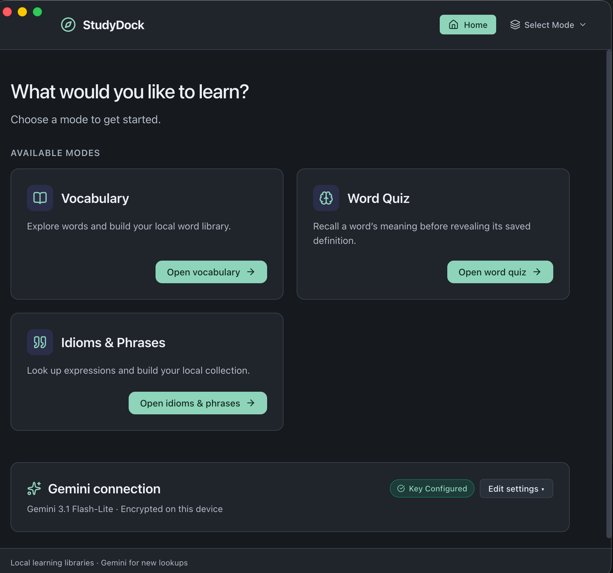
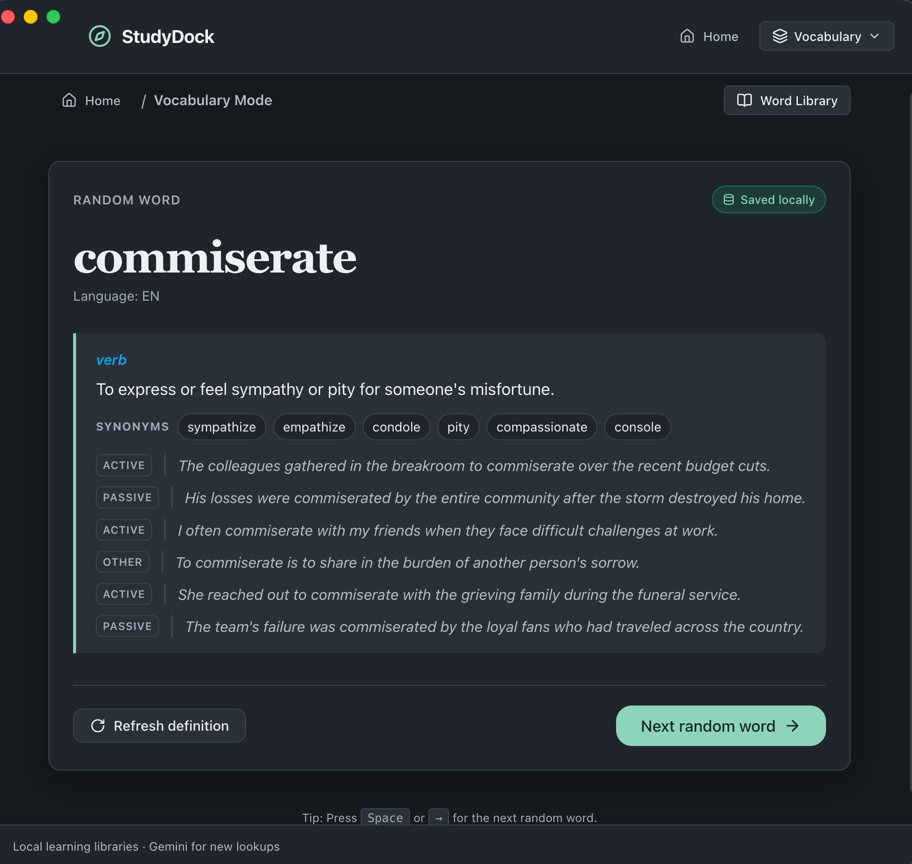
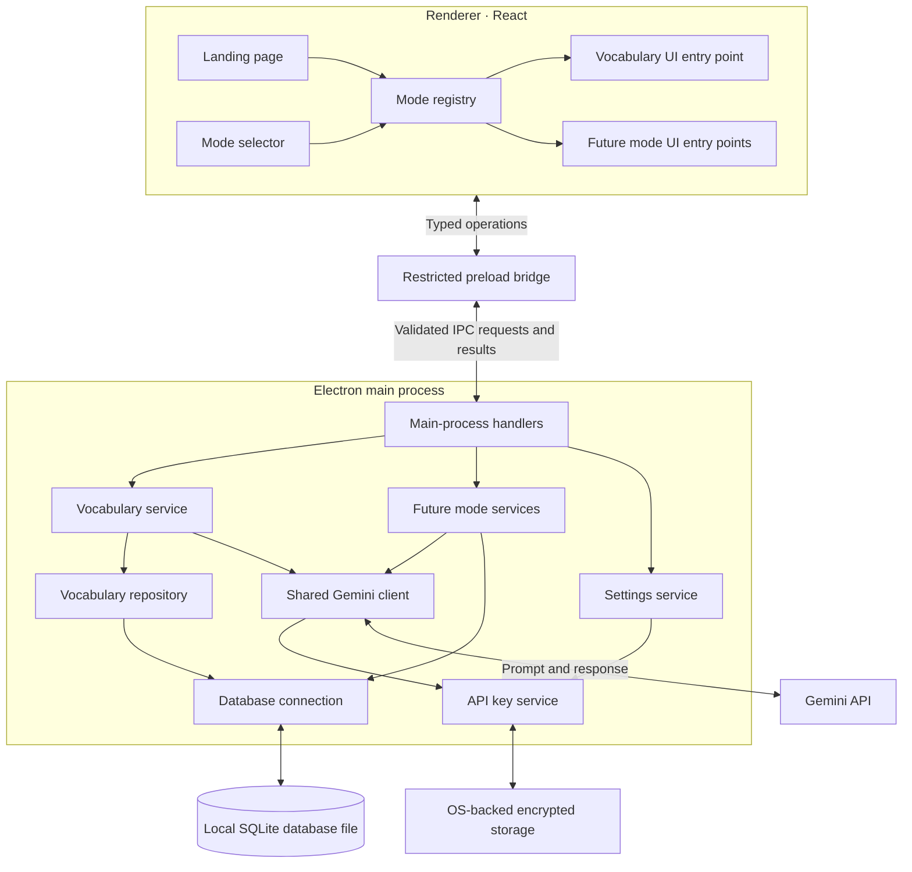

# StudyDock

**StudyDock** is an offline-first desktop personal learning hub built with **Electron**, **TypeScript**, **React**, **Vite**, **SQLite**, and the **Google Gemini SDK**.

The application features an extensible, modular architecture with independent learning modes. **Vocabulary** and **Word Quiz** use the same local word library. **Idioms & Phrases** has its own verified lookup flow and local expression library.

## Screenshots

### Landing page



### Vocabulary mode



---

## Architecture Overview

StudyDock enforces strict process isolation:

1. **Renderer Process (React & TSX):** UI components, mode navigation, and UI state. The renderer has zero direct access to Node.js, SQLite, the filesystem, or stored API keys.
2. **Preload Bridge:** A restricted, typed bridge exposing approved named operations to `window.studydockBridge`.
3. **Main Process (Electron & Node.js):** SQLite database access with transactions and migrations, OS-backed API key encryption, and shared Gemini client integration.



---

## Application Data & Storage Layout

All runtime application data is stored in Electron's per-user application data directory (`app.getPath('userData')`), completely outside source and compiled application trees.

```text
StudyDock application data/
  database/
    studydock.sqlite
  settings/
    preferences.json
  secrets/
    gemini-key.enc
  backups/
  storage/
    audio/
      vocab-pronunciation/  # Compressed μ-law audio generated on demand
    modes/
      vocab/
```

- **Database (`database/studydock.sqlite`):** Words, definitions, and migration history managed with SQLite WAL mode and foreign-key enforcement.
- **Settings (`settings/preferences.json`):** Application preferences such as the selected Gemini model (`gemini-2.5-flash`, `gemini-2.0-flash`, etc.).
- **Secrets (`secrets/gemini-key.enc`):** Gemini API key encrypted using Electron's OS-backed `safeStorage` (Keychain on macOS, DPAPI on Windows, Secret Service on Linux). If OS encryption is unavailable, keys are kept in session memory only and never written unencrypted to disk.
- **Pronunciation audio (`storage/audio/vocab-pronunciation/`):** On first playback, StudyDock asks Gemini's text-to-speech service for its default WAV audio, converts it in memory to compact 8 kHz μ-law audio, and saves only those compressed bytes (`.ulaw` files). The renderer decodes the cached bytes in memory for playback; it does not create an uncompressed audio file. Later playback uses the cached file and works offline. The word text and language are sent to Gemini when the audio is first generated; this uses Gemini API quota. Generated pronunciation files are separate from the word database and ordinary word exports.

### Files created by Electron and Chromium

Electron also keeps a Chromium browser profile alongside StudyDock's application data. These entries support the embedded app window; they are not StudyDock's word database or Gemini settings. Chromium may recreate cache and journal entries as needed.

| Entry | Purpose |
|---|---|
| `Cache/` | Cached web resources used to render the app. |
| `Code Cache/` | Cached compiled browser scripts to help the interface load faster. |
| `GPUCache/`, `GPUPersistentCache/`, `DawnGraphiteCache/`, `DawnWebGPUCache/`, `GraphiteDawnCache/` | Graphics and GPU rendering caches. |
| `Cookies`, `Cookies-journal` | Chromium cookie store and its temporary database journal. |
| `DIPS`, `DIPS-wal` | Chromium site interaction and privacy state; the `-wal` entry is a SQLite write-ahead log. |
| `Local Storage/` | Browser-style local storage used by app web content. StudyDock's primary vocabulary data is stored in its SQLite database. |
| `Session Storage/` | Short-lived browser storage associated with app pages and sessions. |
| `Shared Dictionary/` | Cached compression dictionaries that Chromium can use for network resources. |
| `Trust Tokens`, `Trust Tokens-journal` | Chromium-managed trust-token data and its temporary journal. |
| `blob_storage/` | Browser-managed data backing temporary web blobs. |
| `Local State`, `Preferences` | Chromium and Electron profile settings. |
| `Network Persistent State` | Persistent state used by Chromium's network stack. |
| `declarative_performance_observer.db`, `declarative_performance_observer.db-journal` | Chromium performance-observation data and its temporary database journal. |
| `backups/` | Reserved for StudyDock database backups. |
| `storage/` | Persistent files owned by StudyDock modes, including generated pronunciation audio. |

Files ending in `-wal` or `-journal` are database support files. Let the app and SQLite manage them; do not manually remove them while StudyDock is open. This README describes file purposes only and does not include a machine-specific storage location.

---

## Development & Build Commands

### Prerequisites
- **Node.js**: v20+ or v24+
- **npm**: v10+

### 1. Install Dependencies
```bash
npm install
```
*(Native SQLite dependencies for Electron will automatically be compiled via the postinstall script)*

### 2. Run in Development Mode
Compiles the main and preload scripts and starts Vite dev server with Electron:
```bash
npm run dev
```

### 3. Type Checking
Verifies full TypeScript typing across main, preload, renderer, shared contracts, and tests:
```bash
npm run typecheck
```

### 4. Run Automated Tests
Runs unit and integration tests using Vitest:
```bash
npm test
```

### 5. Production Build
Performs type checking, bundles the React interface with Vite, and compiles the Electron main and preload scripts:
```bash
npm run build
```

### 6. Start Compiled Production App
```bash
npm start
```

### 7. Package Desktop Application
Creates distributable installers (`.dmg`/`.zip` on macOS, `.exe` NSIS installer on Windows, `.AppImage` on Linux) in the `release/` directory:
```bash
npm run package
```

To create only a macOS `.dmg`, run `bash scripts/build-macos-dmg.sh` (or `npm run package:mac`) on a Mac. Install dependencies first with `npm ci`. The disk image is written to `release/` and is built for the Mac's current architecture. Apple Developer signing and notarization are not configured, so macOS may show a first-open security warning.

The macOS app and disk image use the StudyDock open-book-and-compass icon from `assets/studydock.icns`; its 1024-pixel PNG source is `assets/studydock-icon.png`.

## Versioning

StudyDock bumps its semantic version on every commit and records the new version in both `package.json` and `package-lock.json`. Enable the repository's commit hook once after cloning:

```bash
git config core.hooksPath .githooks
```

The hook uses the commit message to choose the bump:

- **Major:** add `!` after the commit type, such as `feat!: replace the vocabulary data format`, or include a `BREAKING CHANGE:` footer.
- **Minor:** start the subject with `feat:`, such as `feat: add phrase review`.
- **Patch:** all other commit messages, such as `fix: handle missing audio` or `docs: clarify setup`.

For example, `1.4.2` becomes `2.0.0` for a major change, `1.5.0` for a feature, or `1.4.3` for a patch. The hook stages only the two version files along with the commit. Keep those files free of unstaged edits when committing so the hook can safely update them.

---

## How to Add a New Learning Mode

Adding a new independent learning mode (e.g. `Grammar`, `Flashcards`, or `Math`) requires 4 simple steps without editing any existing vocabulary files:

### Step 1: Define Mode Contracts & Migrations
Create `src/main/modes/<modeId>/migrations/001_initial.ts`:
```ts
import { Migration } from '../../../database/migrations';

export const modeInitialMigration: Migration = {
  id: '<modeId>_001_initial',
  name: 'Initial schema for <modeId>',
  modeId: '<modeId>',
  up: (db) => {
    db.exec(`
      CREATE TABLE IF NOT EXISTS <modeId>_records (
        id TEXT PRIMARY KEY,
        title TEXT NOT NULL,
        created_at TEXT NOT NULL
      );
    `);
  }
};
```

### Step 2: Implement Main Process Service & Repository
Create `src/main/modes/<modeId>/service.ts` and `src/main/modes/<modeId>/index.ts` to register IPC handlers and export the mode descriptor:
```ts
import { ModeDescriptor } from '../../../shared/contracts/modes';

export const myModeDescriptor: ModeDescriptor = {
  id: 'mymode',
  displayName: 'My Mode',
  description: 'Practice and master new skills.',
  iconName: 'Sparkles',
  order: 2
};
```

### Step 3: Implement Renderer Component
Create `src/renderer/modes/<modeId>/MyModePage.tsx`:
```tsx
import React from 'react';

export const MyModePage: React.FC<{ onNavigateHome: () => void }> = ({ onNavigateHome }) => {
  return (
    <div className="card">
      <h1>My Learning Mode</h1>
      <button className="btn btn-secondary" onClick={onNavigateHome}>Back Home</button>
    </div>
  );
};
export default MyModePage;
```

### Step 4: Register in Mode Registry
Add the entry in `src/renderer/shell/modeRegistry.ts`:
```ts
import React from 'react';

modeRegistry['mymode'] = {
  descriptor: {
    id: 'mymode',
    displayName: 'My Mode',
    description: 'Practice and master new skills.',
    iconName: 'Sparkles',
    order: 2
  },
  component: React.lazy(() => import('../modes/mymode/MyModePage'))
};
```
The application shell, landing page cards, header navigation, and error boundary will automatically detect, list, and render your new mode.

### Word Quiz

Word Quiz selects randomly from vocabulary entries that already have one or more saved definitions. Its **Word Library** button also lets learners select a saved, defined word directly; the quiz loads only the word until **Reveal definition** is chosen. The main process reads and returns saved meanings on reveal. Once revealed, **Refresh definition** explicitly regenerates the saved meanings, synonyms, and examples through Gemini. Hiding the answer clears it from the screen state; selecting another word resets the reveal state. The mode has its own renderer and main-process entry points, reads the existing vocabulary tables, adds no duplicate word data or migrations, and otherwise does not call Gemini.

Vocabulary definitions include up to eight generated synonyms specific to each meaning, plus six example sentences labeled by grammatical voice when appropriate. Synonyms are stored per definition in `vocab_definition_synonyms`, and examples are stored in order in `vocab_definition_examples`; the original example column remains for compatibility. Migrations preserve existing definitions and examples; definitions already in the library start with an empty synonym list. New or explicitly refreshed Gemini definitions request synonyms and six distinct examples, while cached definitions do not trigger paid requests automatically.

Adding a new vocabulary entry from **Add Word** asks Gemini to verify the term and generate its definitions, synonyms, and examples before saving anything. If Gemini recognizes a likely alternate spelling, StudyDock offers it for the learner to choose and verifies the chosen spelling before saving. Unrecognized terms are not added, and lookup failures are shown as recoverable messages. This action requires a configured Gemini key, an internet connection, and may incur API usage. Existing library entries and word imports remain local operations.

### Idioms & Phrases

Choose **Idiom** or **Phrase**, enter an expression, and choose **Look up & Save**. Gemini verifies the expression and returns a meaning and natural example sentences. Recognized expressions are stored locally; unrecognized expressions are not saved. The library can be searched, filtered by type, and browsed in six-entry pages while remaining available offline. Choose **Practice** to open the offline **Guess the meaning** quiz: the expression appears first, and its saved meaning and examples are loaded only after **Reveal meaning**. New lookups require a configured Gemini key and internet access, and may incur API usage. Data is stored in the mode-owned `idioms_phrases_entries` and `idioms_phrases_examples` tables; the mode has its own prompt, validation, service, repository, migration, renderer, and IPC operations.

---

## Manual Gemini Connection Verification

To verify live connectivity with the Google Gemini API:
1. Launch the application (`npm start` or `npm run dev`).
2. On the **Landing Page**, locate the **Gemini AI Connection** card.
3. Paste your Gemini API key (starts with `AIzaSy...`).
4. Click **Save Key** to persist it using OS-backed encryption.
5. Click **Test Connection**. StudyDock sends a minimal ping request and reports success along with the measured response latency.
6. Open **Vocabulary Mode** and click **Next random word** or add a custom word to query structured definitions in real time.

## Testing a Gemini key before saving

Paste a key into the Gemini settings field and click **Test Connection**. The entered key takes precedence over any saved key and is not persisted by testing. An empty field tests the saved key. Testing makes one small Gemini request, may incur API usage, and has a 15-second request timeout. Save Key remains a separate action.

## Gemini model selection

New installations default to `gemini-3.5-flash-lite`. Existing model preferences are preserved: if a legacy model fails, select a current model manually. **Refresh available models** queries Google using the entered key, or the saved key when the field is empty, without storing the entered key. The list filters for Gemini generateContent models suitable for text; listing does not guarantee generation access or structured-output support. Run **Test Connection** to verify generation access. Google restricts older 2.5 models for some projects. See https://ai.google.dev/gemini-api/docs/models.

## Compact Gemini settings

When a key is configured, the landing page initially shows a compact Gemini summary with the selected model and key storage status. **Edit settings** expands all existing controls; **Hide settings** collapses them. First-time setup and removing a saved key show the controls automatically. Key configured does not imply that a live connection test has succeeded.
